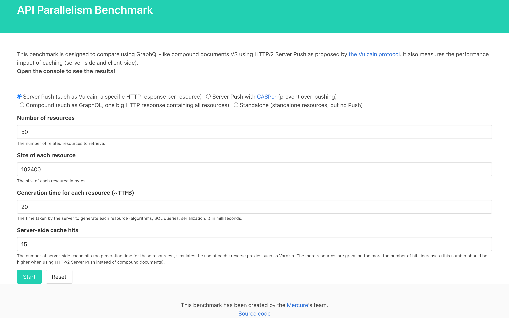

# API Parallelism Benchmark

This benchmark is designed to compare using GraphQL-like compound documents VS using HTTP/2 Server Push as proposed by [the Vulcain protocol](https://vulcain.rocks).

It also measures the performance impact of caching (server-side and client-side).

## Results

With Google Chrome and the settings shown in this screenshot, I get the following results:

In these conditions (and with a warm TCP connection for both cases), HTTP/2 Server Push is **4 time** faster than creating a compound documents.

Method                 | time (lowest is better)
-----------------------|------------------------
**HTTP Server Push**   | 214.34
**Compound documents** | 894.74

For smallest documents, multiplexing is almost useless. For medium and large ones, it helps a lot. The larger the volume of data, the more efficient the split over multiple HTTP responses.

Also, splitting data in small atomic documents allows to improve the HTTP cache efficiency: a response containing little data is less likely to be stale than a big response containing compound documents.

I'll publish more examples and a detailed analysis at some point. In the meantime, feel free to run the benchmark with your own inputs and share the results!

## Run the Benchmark

### Public Server

#### With Docker

    docker run -e EMAIL=kevin@dunglas.fr -e DOMAIN_NAME=foo.com dunglas/api-parallelism-benchmark

#### Using Your Own Build

    EMAIL=you@example.com DOMAIN_NAME=example.com ./api-parallelism-benchmark

### Localhost

1. Install [mkcert](https://github.com/FiloSottile/mkcert) and generate certificates
2. Run the server using the local certs:

       mkcert -install
       mkcert -key-file key.pem -cert-file cert.pem local.example.com
       CERT_FILE=cert.pem KEY_FILE=key.pem ./api-parallelism-benchmark

## TODO

[ ] * Add support for [Preload links](https://www.w3.org/TR/preload/)
[ ] * Add support for [Early Hints](https://tools.ietf.org/html/rfc8297)
[ ] * Maybe use the Caddy Server and the Vulcain module directly (they already support HTTP/3 and Preload links)
[ ] * find a way to compare [cold vs warm TCP connections](https://blog.donatas.net/blog/2015/08/08/slow-start-after-idle/)
